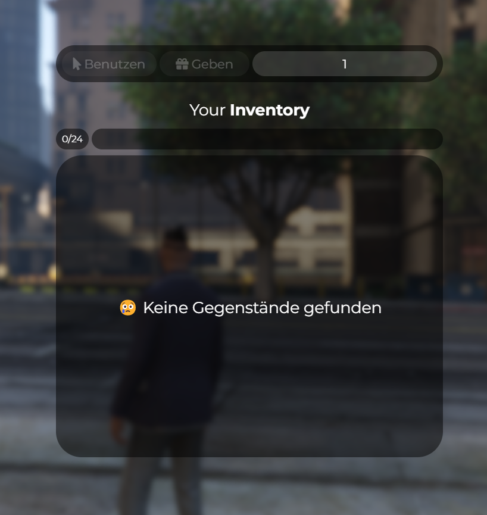

# FiveM ESX Inventory – Kostenloses Inventar-System für deinen Server 💼📦

Du suchst ein funktionales, modernes und cleanes Inventory für deinen FiveM Roleplay Server?  
Dieses Script ist komplett kostenlos, basiert auf ESX und kombiniert clientseitige und serverseitige Funktionen für maximale Kompatibilität und Performance.  
Perfekt für RP-Server, die ein leichtgewichtiges, aber visuell ansprechendes Inventar suchen.

Das Interface zeigt deine Items klar an, unterstützt Item-Nutzung sowie das Weitergeben von Items und enthält eine Slot-Anzeige (zum Beispiel 0/24).  
Wenn keine Items vorhanden sind, erscheint eine freundliche Meldung mit Emoji. Die Benutzeroberfläche ist schlicht gehalten und passt sich an verschiedene Bildschirmgrößen an.

---

## Features

- Kompatibel mit ESX Framework  
- Client- und serverseitig umgesetzt  
- Klar strukturiertes UI mit Slot-System  
- Items benutzen und geben möglich  
- Anzeige bei leerem Inventar mit Emoji 😲  
- Mehrsprachig erweiterbar (Standard: Deutsch und Englisch)  
- Minimalistisch, responsive und leicht anpassbar  
- Ideal für Roleplay-Server jeder Art  

---

## Screenshots

### Normales Inventar (geöffnet)

### Handschuhfach im Fahrzeug

---

## Keywords (für maximale Auffindbarkeit)

FiveM Inventory, FiveM Inventory Script, ESX Inventory, ESX Inventory UI, FiveM UI Script, Free FiveM Inventory, Inventory for RP Server, FiveM RP Inventory, ESX Roleplay Inventory, Free FiveM Script, FiveM Item System, minimalist FiveM Inventory, responsive Inventory FiveM, inventory slots fivem, fivem esx inventory system, deutsch fivem script, fivem inventory deutsch, fivem ui inventory, fivem item menu, fivem resource esx, fivem inventory free download, fivem roleplay item system, fivem inventory deutsch kostenlos, inventory script esx fivem

---

Viel Spaß damit! 💡🧠
